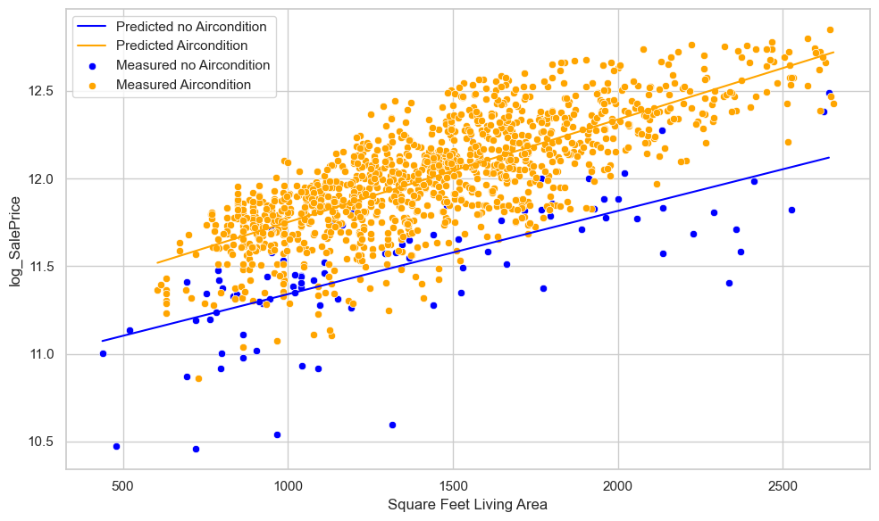

# INFERENTIAL-STATISTICS
key messages:
house prices increase with aircon, but the interaction is only slightly:

# Regression Analysis Readme

## Overview

This repository contains Python code for a regression analysis using the statsmodels library. The analysis focuses on predicting house prices (`SalePrice`) based on various predictors, including living area (`GrLivArea`), central air conditioning (`CentralAir`), and street type (`Street`).

## Files

- **Regression Analysis Notebook:** [`house_price_prediction.ipynb`](house_price_prediction.ipynb)
  - Jupyter Notebook containing the step-by-step regression analysis.

- **Data File:** [`train.csv`](train.csv)
  - Dataset used for the analysis: https://www.kaggle.com/datasets/lespin/house-prices-dataset

## Steps

1. **Data Loading and Preprocessing:**
   - Load the dataset (`train.csv`), again from https://www.kaggle.com/datasets/lespin/house-prices-dataset
   - Choose predictors (`SalePrice`, `GrLivArea`, `CentralAir`, `Street`) and encode categorical variables.

2. **Leverage Points Detection:**
   - Identify and remove high leverage points in the dataset.

3. **Stepwise Regression:**
   - Perform stepwise regression to select significant predictors.
   - Check p-values to determine predictor significance.

4. **Interaction Analysis:**
   - Explore interactions between predictors (`GrLivArea`, `CentralAir`, `Street`).
   - Build and refine regression models based on interaction terms.

5. **Final Model:**
   - Build the final regression model with selected predictors.
   - Check for heteroscedasticity and outliers.

6. **Model Visualization:**
   - Visualize the predicted values and measured values for the final model.

7. **Testing and Transforming:**
   - Check and remedy heteroscedasticity.
   - Transform the model if needed.

8. **Visualize Final Model:**
   - Visualize the final model with predicted values.

9. **Regression Summary:**
   - Save the regression summary table as a text file and image.

## Additional Notes

- The analysis includes steps for handling heteroscedasticity and outliers.
- Model predictions are visualized using line and scatter plots.
- The regression summary is saved as both text (`regression_table.txt`) and image (`regression_table.png`).

Feel free to explore the Jupyter Notebook for a detailed walkthrough of the regression analysis.

